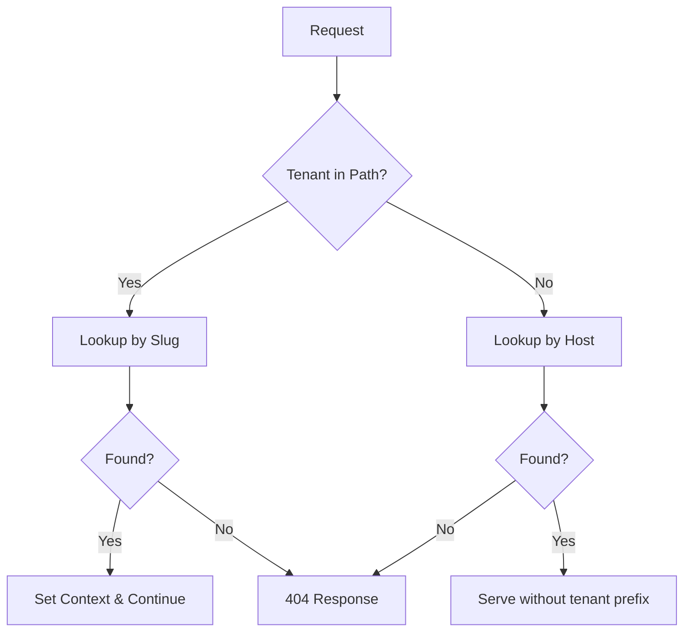

# Public URL Migration Guide

This guide documents the migration of `awcms-public` from root-based tenant resolution to path-based tenant resolution.

---

## Overview

| Aspect | Before | After |
| :--- | :--- | :--- |
| **URL Structure** | `/articles` | `/{tenant}/articles` |
| **Tenant Resolution** | Domain/subdomain only | Path parameter (primary) + domain fallback |
| **Canonical Form** | `tenant.example.com/page` | `example.com/tenant/page` (path-based; host-based still supported) |

---

## URL Format Changes

### Old Format (Deprecated)

```txt
https://primary.example.com/
https://primary.example.com/articles
https://primary.example.com/pages/about
```

### New Format (Current)

```txt
https://example.com/primary/
https://example.com/primary/articles/
https://example.com/primary/pages/about/
```

---

## Redirect Rules

Path-based URLs are canonical for multi-tenant routing, while host-based domains are still supported without forced redirects.

| Scenario | Behavior |
| :--- | :--- |
| `/{tenant}` vs resolved tenant slug mismatch | Redirects to `/{resolved-tenant}/...` (301) |
| Missing trailing slash | Redirects to trailing-slash URL |
| Host-based domain (`tenant.domain.com`) | Served directly without tenant prefix |

> **Note**: "primary" is the default tenant slug used when a host-based fallback is configured.

---

## How It Works

### 1. Path-Based Resolution (Primary)

The middleware extracts the tenant slug from the first path segment:

```txt
/primary/articles → tenant_slug = "primary"
```

It then looks up the tenant by slug in the `tenants` table.

### 2. Host-Based Resolution (Fallback)

If no tenant is found in the path, the middleware falls back to host-based resolution using the existing `get_tenant_id_by_host` RPC.

If a valid tenant is resolved from the host, the page is served directly without a tenant path prefix (legacy domain support).

---

## Adding a New Tenant

1. Create the tenant in the Admin Panel.
2. Ensure the tenant has a unique `slug` (e.g., `new-tenant`).
3. Access the tenant's public site at `/{slug}/` (e.g., `/new-tenant/`).

---

## Edge Cases

### Unknown Tenant

If a path like `/unknown-tenant/articles` is accessed and `unknown-tenant` doesn't exist in the database, a 404 response is returned:

```txt
Tenant Not Found: "unknown-tenant"
```

### Trailing Slash Policy

All URLs now use **trailing slashes** for consistency:

* ✅ `/primary/articles/`
* ❌ `/primary/articles`

The system automatically redirects non-trailing-slash URLs.

---

## Developer Notes

### URL Builder

Use the `tenantUrl` helper from `src/lib/url.ts` for all internal links:

```typescript
import { tenantUrl } from '../lib/url';

// Example
const articleUrl = tenantUrl('primary', '/articles');
// Result: "/primary/articles"
```

### Middleware Flow



---

## Rollback Procedure

If issues arise, rollback by:

1. Restoring `src/pages/[...slug].astro` (original catch-all route).
2. Reverting `src/middleware.ts` to host-only resolution.
3. Removing `src/pages/[tenant]/` directory.
4. Removing `src/pages/index.astro` host-based handler.
5. Rebuilding and redeploying.
