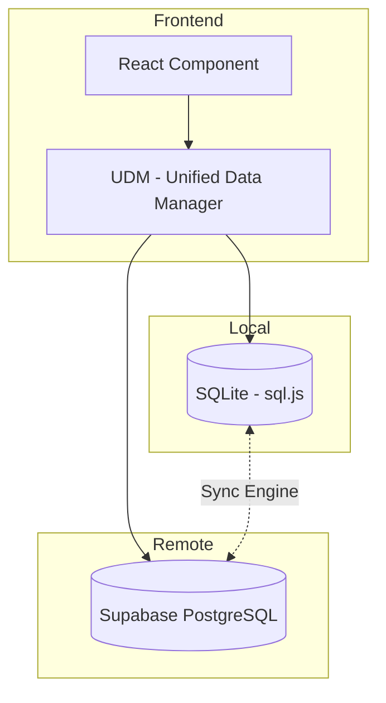

# Offline-First Architecture

AWCMS implements an offline-first architecture for resilient operation in low-connectivity environments.

---

## Overview

The Unified Data Manager (UDM) provides a transparent abstraction layer between components and data sources, enabling:

- Local SQLite caching
- Background synchronization
- Conflict resolution
- Seamless online/offline switching

---

## Architecture



---

## UnifiedDataManager (UDM)

### Location

`src/lib/data/UnifiedDataManager.js`

### Usage

```javascript
import { udm } from '@/lib/data/UnifiedDataManager';

// Same API as Supabase client
const { data, error } = await udm
  .from('articles')
  .select('*')
  .eq('status', 'published');

// Insert (automatically syncs when online)
const { data: newArticle } = await udm
  .from('articles')
  .insert({ title: 'New Article', tenant_id: tenantId });
```

### Supported Operations

| Operation | Offline | Sync Strategy |
|-----------|---------|---------------|
| `select` | ✅ Local cache | Pull on demand |
| `insert` | ✅ Queue locally | Push when online |
| `update` | ✅ Queue locally | Push when online |
| `delete` | ✅ Queue locally | Push when online |

---

## Sync Engine

### Location

`src/lib/data/SyncEngine.js`

### Sync Flow

1. **Detect Online Status**: Monitor `navigator.onLine` and network fetch tests
2. **Push Local Changes**: Send queued mutations to Supabase
3. **Pull Remote Updates**: Fetch changes since last sync timestamp
4. **Resolve Conflicts**: Last-write-wins or custom resolver
5. **Update Local Cache**: Apply changes to SQLite

### Conflict Resolution

```javascript
// Default: Last-write-wins using updated_at
const resolveConflict = (local, remote) => {
  return new Date(local.updated_at) > new Date(remote.updated_at) 
    ? local 
    : remote;
};
```

---

## Local Database (SQLite)

### Implementation

Uses `sql.js` (SQLite compiled to WebAssembly) for browser-based storage.

### Schema Mirroring

Local SQLite schema mirrors Supabase tables:

```sql
CREATE TABLE articles (
  id TEXT PRIMARY KEY,
  tenant_id TEXT NOT NULL,
  title TEXT,
  content TEXT,
  status TEXT,
  created_at TEXT,
  updated_at TEXT,
  _sync_status TEXT DEFAULT 'synced'
);
```

### Sync Metadata

| Column | Purpose |
|--------|---------|
| `_sync_status` | `synced`, `pending_push`, `conflict` |
| `_local_updated_at` | Local modification timestamp |
| `_remote_updated_at` | Last known remote timestamp |

---

## Offline-Enabled Modules

| Module | Status | Notes |
|--------|--------|-------|
| Articles | ✅ Full | Create, edit, delete offline |
| Pages | ✅ Full | Visual editing offline |
| Products | ✅ Full | Inventory updates queue |
| Users | ❌ Online Only | Requires auth validation |
| Settings | ⚠️ Read Only | Config cached, changes online |
| Media | ⚠️ Partial | View cached, upload online |

---

## Network Detection

```javascript
// src/lib/useNetworkStatus.js
import { useState, useEffect } from 'react';

export function useNetworkStatus() {
  const [isOnline, setIsOnline] = useState(navigator.onLine);
  
  useEffect(() => {
    const handleOnline = () => setIsOnline(true);
    const handleOffline = () => setIsOnline(false);
    
    window.addEventListener('online', handleOnline);
    window.addEventListener('offline', handleOffline);
    
    return () => {
      window.removeEventListener('online', handleOnline);
      window.removeEventListener('offline', handleOffline);
    };
  }, []);
  
  return isOnline;
}
```

---

## Best Practices

1. **Use UDM for Offline Modules**: Replace direct `supabase` calls with `udm`
2. **Handle Sync Conflicts**: Implement UI for conflict resolution
3. **Show Sync Status**: Display pending changes indicator
4. **Graceful Degradation**: Disable online-only features when offline
5. **Tenant Isolation**: Always include `tenant_id` in cached data

---

## Limitations

- Maximum local storage: ~50 MB (browser dependent)
- No realtime subscriptions offline
- Large file uploads require online connection
- Authentication tokens may expire offline

---

## Related Documentation

- [Performance Optimization](PERFORMANCE.md)
- [Database Schema](DATABASE_SCHEMA.md)
- [Multi-Tenancy](MULTI_TENANCY.md)
