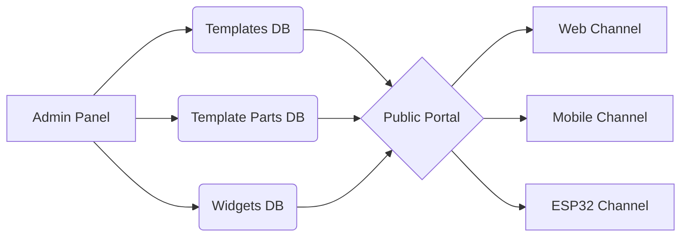

# Template System

AWCMS uses a comprehensive, WordPress-inspired template system that supports multi-tenant, multi-channel, and multi-language content rendering.

## Architecture



## Database Tables

| Table | Description |
|-------|-------------|
| `templates` | Full page layouts (Puck JSON) |
| `template_parts` | Reusable parts (Header, Footer, Widget Areas) |
| `template_assignments` | Route-to-template mappings per channel |
| `widgets` | Widget instances for Widget Areas |
| `template_strings` | Localized strings for templates |

## Admin UI

### Templates Manager (`/cmspanel/templates`)

Provides a tabbed interface:

- **Page Templates**: Manage full page layouts using Visual Builder.
- **Template Parts**: Manage reusable components (Header, Footer, Sidebars).
- **Assignments**: Map system routes (Home, 404, Search) to specific templates per Channel.
- **Languages**: Manage translation strings for template content.

### Widgets Manager (`/cmspanel/widgets`)

Manage widgets within defined Widget Areas. Supports drag-and-drop ordering and configuration.

## Extension API

Extensions can register custom components:

```javascript
import { registerTemplateBlock, registerWidgetArea, registerPageType } from '@/lib/templateExtensions';

// Register a new Puck block
registerTemplateBlock({
    type: 'my_plugin/slider',
    label: 'Image Slider',
    render: MySliderComponent,
    fields: { images: { type: 'array' } }
});

// Register a new widget type
registerWidgetArea({
    type: 'my_plugin/social',
    name: 'Social Links',
    icon: ShareIcon,
    defaultConfig: { networks: [] }
});

// Register a new page type for assignments
registerPageType({
    type: 'product_single',
    label: 'Single Product'
});
```

## Public Portal Rendering

The Astro-based public portal (`awcms-public`) uses a dynamic routing system:

1. Fetch the requested page from `pages` table.
2. Fetch the `template_assignments` for the current channel (`web`).
3. Determine the template to use (page override or assignment default).
4. Merge **Header Part** + **Page Content** + **Footer Part**.
5. Render using `PuckRenderer` and the component registry.

## Multi-Channel Support

| Channel | Description |
|---------|-------------|
| `web` | Standard web pages (SSR/SSG via Astro) |
| `mobile` | Flutter app (JSON API consumption) |
| `esp32` | IoT devices (simplified HTML/text) |

Assignments can be configured per channel, allowing different templates for different platforms.

## Security

All template-related tables enforce multi-tenancy via Row Level Security (RLS). RLS policies ensure data isolation between tenants.
